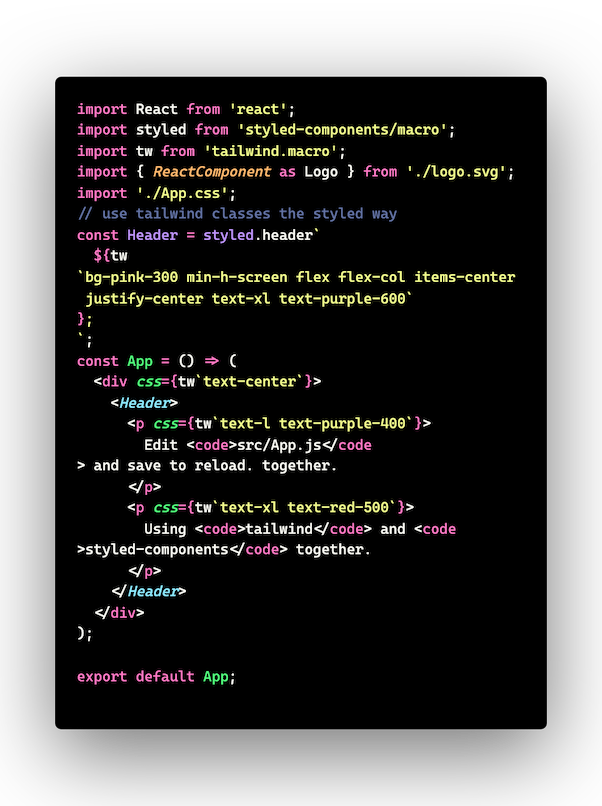

# hyper-draucla-color-theme

## Why?
I love the Dracula syntax colors and Hyper is my favorite terminal as of the moment. While I live mostly in the terminal, I wanted a seamless experience between VS Code and where I spend most of my day - Hyper with tmux.

## Inspiration / Source code
- [Hyper](https://github.com/HasseNasse/hyper-term-theme) theme 
- [Dracula](https://github.com/dracula/visual-studio-code) theme 

## How
Contrary to common belief, creating extensions and color themes to VS Code isn't that hard if you have your busines logic / color codes already.
I used the official [guide](https://code.visualstudio.com/api/extension-guides/color-theme) from Microsoft to get things going and I had one simple objective with this project: Take Dracula ( a theme with very extensive and robust syntax color rules ) and Mash it with Hyper ( a very simple theme ) which has my desired background colors covered)

## Contributing

If you'd like to contribute to this theme, please read the [contributing guidelines](./.github/CONTRIBUTING.md).

## License

[MIT License](./LICENSE)
